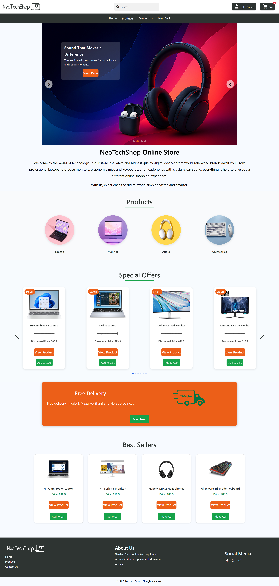
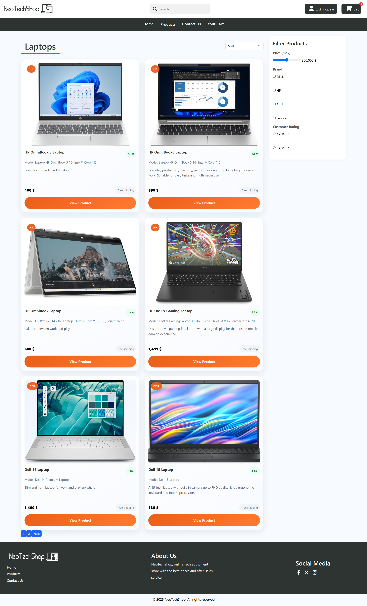
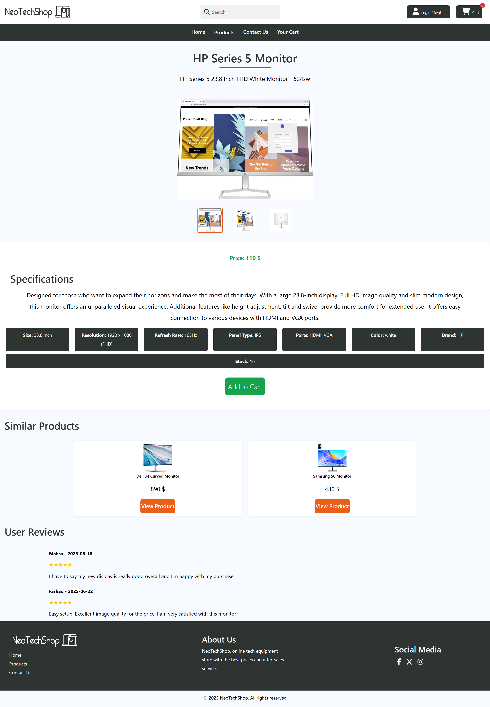
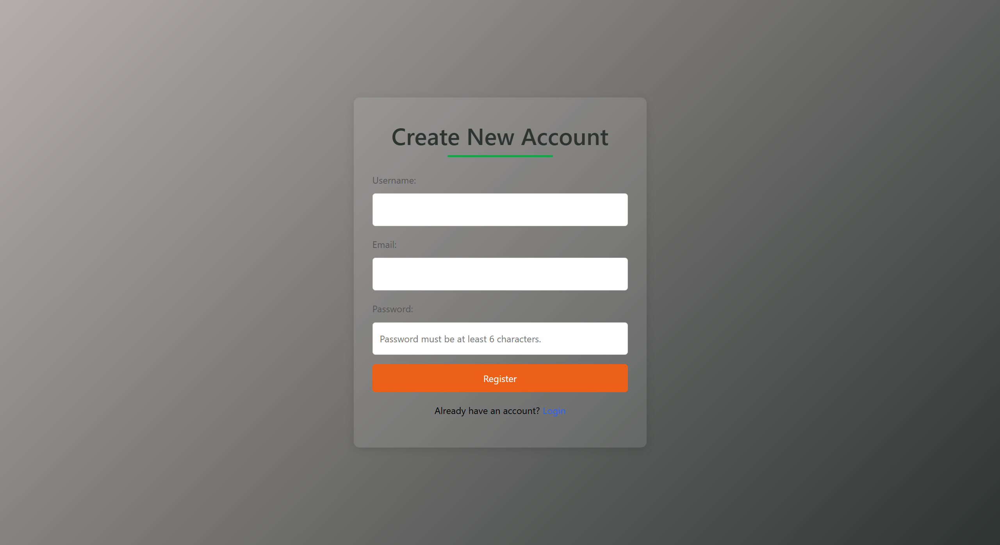
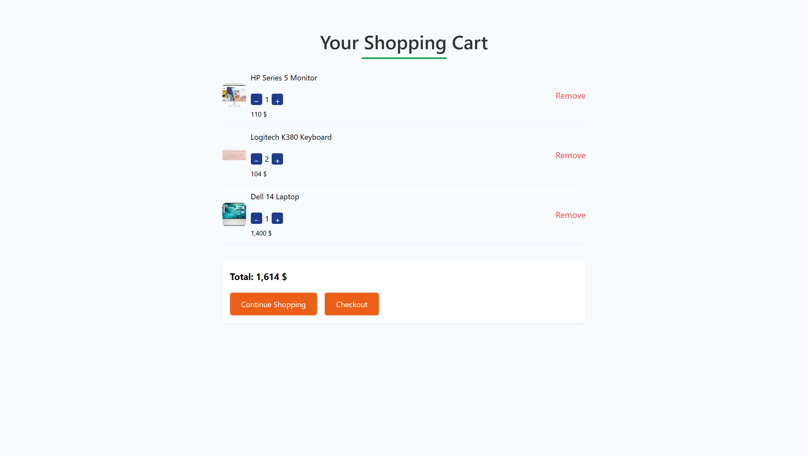
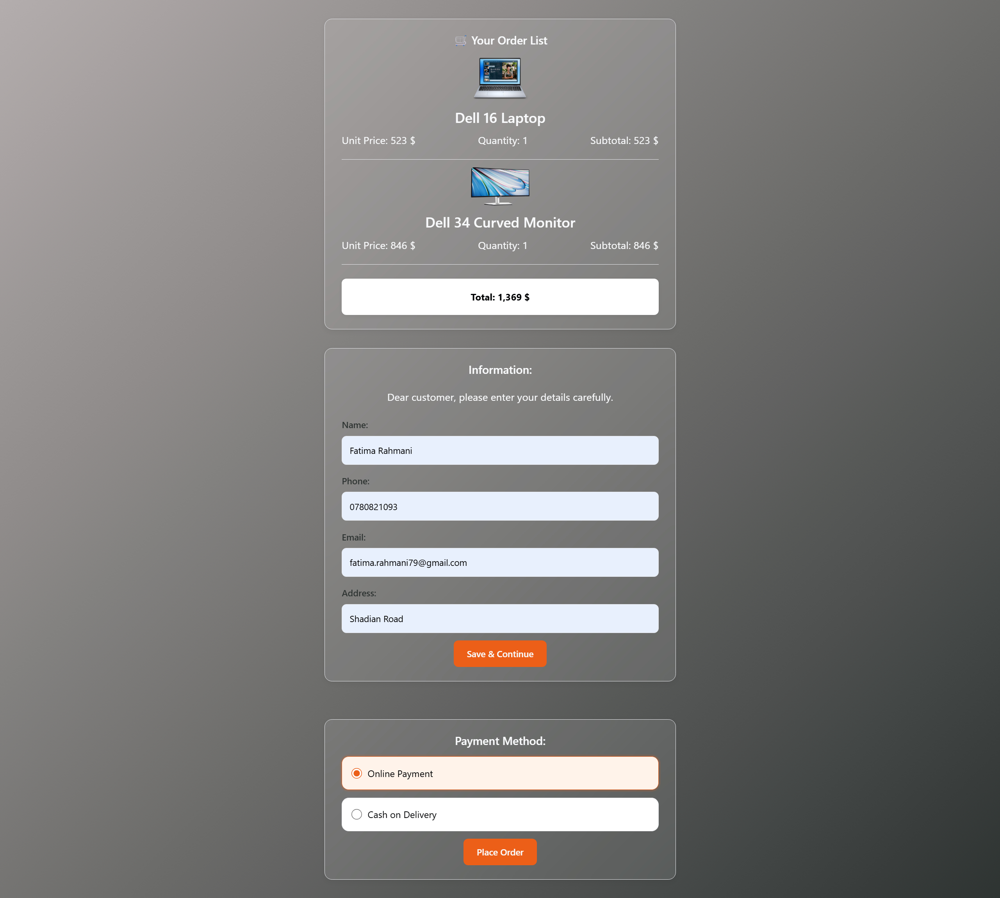
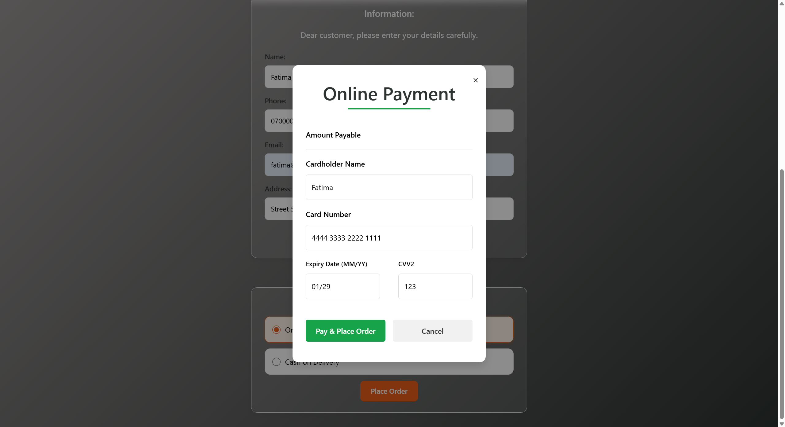
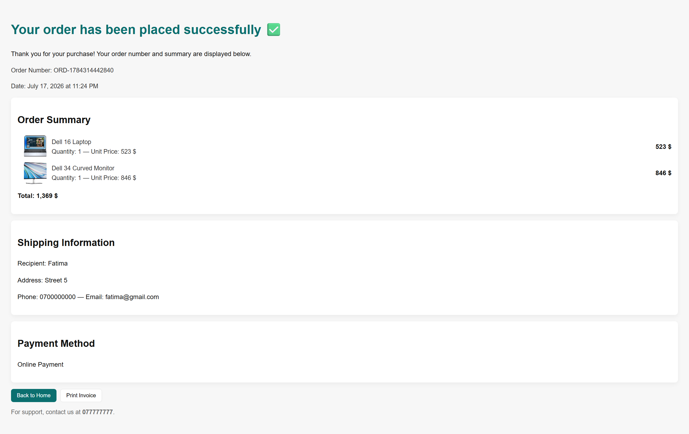

# NeoTechShop

A responsive, front-end e-commerce demo for technology products (laptops, monitors, audio, accessories) built with HTML, CSS, Bootstrap 5, and vanilla JavaScript.

This project is a client-side implementation of an online store. It demonstrates dynamic product rendering from JSON, a persistent shopping cart, a local authentication flow (LocalStorage / SessionStorage), and client-side UX features.

Demo: https://fatima-rahmani79.github.io/NeoTechShop/

## Features

- Multi-page site: Home, product listings, product detail, cart, checkout, auth, contact
- Responsive design (desktop/tablet/mobile)
- RTL Persian layout using Vazir font
- Products loaded from `assets/data/products.json`
- Local user registration and login (LocalStorage / SessionStorage)
- Persistent shopping cart (LocalStorage) with add/remove/update and badge counter
- Client-side search, filtering, and sorting (no page reloads)
- Checkout form validation and Luhn card check (test mode only)
- Two payment options: Online (test) and Cash on Delivery
- Toast notifications and Swiper.js carousels for promotions

## Tech stack

- HTML5, CSS3, Bootstrap 5
- JavaScript (ES6+)
- Swiper.js (carousel)
- Font Awesome
- LocalStorage / SessionStorage
- JSON product data

## Project structure

NeoTechShop/

- assets/
  - css/
  - js/
  - data/
  - images/
  - screenShots/
- index.html
- auth.html
- product.html
- cart-page.html
- checkout.html
- confirmation.html
- accessory-products.html
- audio-products-listing.html
- laptop-products-listing.html
- monitor-products-listing.html
- contact.html
- README.md

Main files:
- `assets/js/script.js` — core logic
- `assets/js/cart.js` — cart management
- `assets/data/products.json` — product data

## Screenshots (two per row)

Below are screenshots from the demo site (located in `assets/screenShots/`). Click any image to view the full-size file.

<!-- Responsive table layout: two images per row on wide screens, single column on narrow screens -->
<style>
  .screenshots-table { width: 100%; border-collapse: collapse; }
  .screenshots-table td { padding: 8px; vertical-align: top; width: 50%; }
  .screenshot-figure { margin: 0; text-align: center; }
  .screenshot-figure img { width: 100%; height: auto; border: 1px solid #ddd; border-radius: 4px; display: block; }
  .screenshot-caption { padding: 6px 0; font-size: 90%; }
  @media (max-width: 800px) {
    .screenshots-table, .screenshots-table tbody, .screenshots-table tr, .screenshots-table td { display: block; width: 100%; }
    .screenshots-table td { padding: 6px 0; }
  }
</style>

<table class="screenshots-table">
  <tr>
    <td>
      <a href="https://raw.githubusercontent.com/Fatima-Rahmani79/NeoTechShop/main/assets/screenShots/index-html.jpg">
        <figure class="screenshot-figure">
          
          <figcaption class="screenshot-caption">Home</figcaption>
        </figure>
      </a>
    </td>
    <td>
      <a href="https://raw.githubusercontent.com/Fatima-Rahmani79/NeoTechShop/main/assets/screenShots/loptop-products-listing-html.jpg">
        <figure class="screenshot-figure">
          
          <figcaption class="screenshot-caption">Laptop products listing</figcaption>
        </figure>
      </a>
    </td>
  </tr>

  <tr>
    <td>
      <a href="https://raw.githubusercontent.com/Fatima-Rahmani79/NeoTechShop/main/assets/screenShots/product-html.jpg">
        <figure class="screenshot-figure">
          
          <figcaption class="screenshot-caption">Product detail</figcaption>
        </figure>
      </a>
    </td>
    <td>
      <a href="https://raw.githubusercontent.com/Fatima-Rahmani79/NeoTechShop/main/assets/screenShots/auth-html.jpg">
        <figure class="screenshot-figure">
          
          <figcaption class="screenshot-caption">Auth / Login</figcaption>
        </figure>
      </a>
    </td>
  </tr>

  <tr>
    <td>
      <a href="https://raw.githubusercontent.com/Fatima-Rahmani79/NeoTechShop/main/assets/screenShots/cart-page-html.jpg">
        <figure class="screenshot-figure">
          
          <figcaption class="screenshot-caption">Cart</figcaption>
        </figure>
      </a>
    </td>
    <td>
      <a href="https://raw.githubusercontent.com/Fatima-Rahmani79/NeoTechShop/main/assets/screenShots/checkout-html.jpg">
        <figure class="screenshot-figure">
          
          <figcaption class="screenshot-caption">Checkout</figcaption>
        </figure>
      </a>
    </td>
  </tr>

  <tr>
    <td>
      <a href="https://raw.githubusercontent.com/Fatima-Rahmani79/NeoTechShop/main/assets/screenShots/checkout-html-2.png">
        <figure class="screenshot-figure">
          
          <figcaption class="screenshot-caption">Checkout (alt)</figcaption>
        </figure>
      </a>
    </td>
    <td>
      <a href="https://raw.githubusercontent.com/Fatima-Rahmani79/NeoTechShop/main/assets/screenShots/confirmation.jpg">
        <figure class="screenshot-figure">
          
          <figcaption class="screenshot-caption">Confirmation</figcaption>
        </figure>
      </a>
    </td>
  </tr>
</table>


## Getting started

Requirements: modern browser. Optional: Node.js for local server.

Clone the repository:

```bash
git clone https://github.com/Fatima-Rahmani79/NeoTechShop.git
cd NeoTechShop
```

Run locally:

- Open `index.html` directly in your browser, or
- Use a simple server (recommended):

```bash
npx live-server
# or
npx http-server -c-1
```

## Usage

- Browse and filter products, add items to the cart.
- Register and log in on the Auth page to enable checkout.
- Complete the checkout form to place an order (client-side only).

Test payment (online test mode):

- Card number: `4444 3333 2222 1111` (test)
- Use an expiry date within the next 10 years

Notes: All data and authentication are client-side only; no real payments or server processing are performed.

## Customize

- Edit `assets/data/products.json` to change product data.
- Update styles in `assets/css/main.css`.
- Modify behavior in `assets/js/*.js`.

## Contributing

Issues and pull requests are welcome. For code changes, please open a PR with a clear description and screenshots if applicable.

## License

No license file is included. Add a `LICENSE` (for example MIT) if you want to make this project open source.

## Author

Fatima Rahmani — fatima.rahmnai79@gmail.com


*Updated README to show screenshots two images per row.*